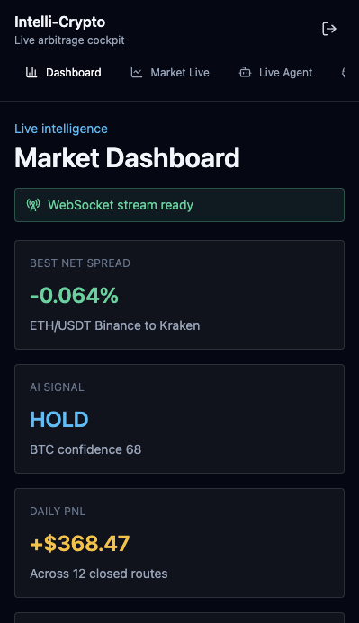
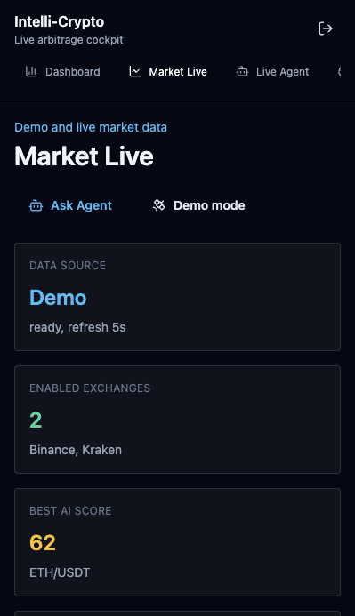

# Intelli-Crypto

Foundation for a real-time crypto intelligence and arbitrage platform.

## Project Structure

```text
backend/
  manage.py
  requirements.txt
  intelli_crypto/
    asgi.py
    settings.py
    urls.py
  arbitrage/
    consumers.py
    routing.py
    services/
      arbitrage_engine.py
      crypto_ai.py
    management/commands/
      run_arbitrage_engine.py
src/
  components/
  pages/
  state/
docker-compose.yml
Dockerfile.backend
```

## Frontend Setup

```bash
npm install
npm run dev
```

Local app:

```text
http://localhost:5173/
```

The current application includes:

- Landing page with a 3D Market Galaxy.
- Registration with username, email, password, expertise level, jurisdiction, base currency, risk profile, max trade size, exchange coverage, 2FA, and risk disclosure.
- Login and protected application shell.
- Dashboard, AI Insights, Buy / Sell, History, Logs, and User Settings pages.
- AI suggestion cards, prediction cards, and risk checks prepared for backend `CryptoAI` integration.
- Market Live page with Demo and Live modes, public exchange quote fetching, fee-aware route scoring, and fallback demo quotes.
- Expanded settings for exchange coverage, fee/slippage model, refresh interval, paper trading, smart alerts, anomaly detection, whale watch, and execution safety.
- Live Agent chatbot that answers app and market questions from current quotes, arbitrage routes, AI predictions, exchange coverage, logs, history, and user settings.
- MySQL-backed operator registration/login, profile settings, paper-trade history, and system logs.
- A preserved browser-only Demo workspace available from the login screen.
- Server-side live market snapshots through CCXT, with public browser adapters and demo quotes as fallbacks.
- Live mean-reversion and RSI predictions computed from 100 real Kraken 5-minute candles.

## cPanel Static Build

Build the frontend for cPanel:

```bash
npm install
npm run build:cpanel
```

Upload the contents of `dist/` to your cPanel `public_html` folder.

The build includes:

- `.htaccess` for React Router SPA fallback.
- `robots.txt` for crawler access.
- `sitemap.xml` using the current public Vercel URL.

If you deploy to a custom cPanel domain, update `public/robots.txt` and `public/sitemap.xml` before running the build.

## Screenshots

### Dashboard



### Market Live



## Local MySQL + Backend Setup

The checked-in `backend/.env.example` documents the required variables. The local `backend/.env` is ignored by Git and is already configured for the local MySQL server.

```bash
mysql -u root -p -e "CREATE DATABASE IF NOT EXISTS intelli_crypto CHARACTER SET utf8mb4 COLLATE utf8mb4_unicode_ci;"
python3 -m venv backend/.venv
backend/.venv/bin/pip install -r backend/requirements.txt
backend/.venv/bin/python backend/manage.py migrate
backend/.venv/bin/python backend/manage.py runserver 127.0.0.1:8000
```

In another terminal, start the frontend:

```bash
npm install
npm run dev
```

Open `http://localhost:5173`. Register for a MySQL-backed workspace, or choose **Continue with demo** for the original browser-only version.

The API health endpoint is:

```text
http://127.0.0.1:8000/api/health/
```

Set `VITE_API_URL` if the backend is not available at `http://127.0.0.1:8000/api`.

## Optional Docker Backend

Docker connects to the same MySQL server running on the host:

```bash
docker compose build
docker compose up backend redis
docker compose run --rm backend python manage.py migrate
```

Run the real-time WebSocket publisher with an optional exchange override:

```bash
docker compose run --rm backend python manage.py run_arbitrage_engine --exchanges binance,kraken,coinbase,okx,bybit,kucoin
```

WebSocket stream:

```text
ws://localhost:8000/ws/arbitrage/
```

## Notes

- Exchange calls use `ccxt.async_support` and `asyncio.gather` to avoid blocking.
- WebSocket publishing uses Django Channels and Redis.
- The arbitrage engine supports `BTC/USDT` and `ETH/USDT` across Binance, Kraken, Coinbase, OKX, Bybit, and KuCoin.
- Live prices are real public market data. Order placement is deliberately paper-only until exchange API credentials, secret vaulting, withdrawal locks, allowlists, and kill switches are configured.
